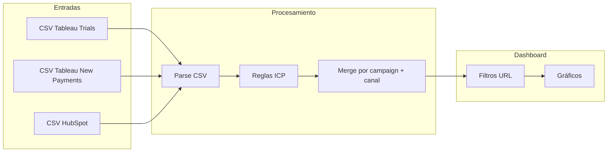

# Plan: Dashboard de conversión Nurturing MX (MVP)

## Objetivo del MVP

Poder **subir 3 CSVs** (Tableau trials, Tableau new payments, HubSpot engagement), **normalizar canales con reglas ICP** sobre `utm_content` y **ver en un dashboard** qué campaign/canal convierte más (trials + new payments) y cómo se relaciona con opens, clicks, CTR, spam, etc., con **filtros por URL** y **identidad Tiendanube**.

---

## Arquitectura de datos

- **CSV Tableau Trials**: identificador UTM (`utm_campaign`, `utm_content` o URL) y columna de **trials**. Estructura similar al de new payments.
- **CSV Tableau New Payments**: mismo tipo de identificador UTM y columna de **new payments** (NP). Opcional: fecha en ambos.
- **CSV HubSpot**: mismo identificador UTM, **opens**, **clicks**, **CTR**, **spam** (y opcionalmente bounces, etc.). Opcional: fecha.
- **Clave de cruce**: `utm_campaign` + **canal normalizado** (resultado de ICP sobre `utm_content`). Los tres CSVs se unen por esa clave; trials y new payments se suman/agregan por fila UTM y luego se cruzan con HubSpot.

---

## Reglas ICP (6 canales finales)

Se aplican en orden de prioridad sobre el valor de `utm_content` (o combinación de canales detectados en el string, ej. "marcademodas100229-", "tiendaonline", "redes"):

| Prioridad | Canal resultado           | Condición                                                                                               |
| --------- | ------------------------- | ------------------------------------------------------------------------------------------------------- |
| ICP1      | **Tienda online**         | Si aparece tienda online (ej. "tiendaonline", "tienda-online") en content/canales.                      |
| ICP2      | **Redes sociales**        | Si aparece redes y no aplica ICP1.                                                                      |
| ICP3      | **Marketplace**           | Si aparece marketplace y no aplica ICP1 ni ICP2.                                                        |
| ICP4      | **Tienda física**         | Si aparece tienda física y no aplica ICP1, ICP2 ni ICP3.                                                |
| ICP5      | **No vendo / No sabemos** | Si aparece "no vendo" o "no sabemos" o información faltante; o si no matchea ninguno de los anteriores. |

En el código se definirá un **diccionario de patrones** (keywords) por canal y un **orden de evaluación** para clasificar cada fila en exactamente uno de los 6 canales. Así las UTMs dinámicas (varios canales en `content`) se colapsan a un solo canal para reporte.

---

## Stack técnico propuesto

- **Framework**: Next.js 14+ (App Router) para SSR, rutas y despliegue en Vercel.
- **UI y gráficos**: React + librería de gráficos (p. ej. **Recharts** o **Tremor**) para tablas y gráficos de barras/líneas por campaign, canal, etapa.
- **Estado y URL**: Filtros (canal, etapa de funnel) en **query params** con `useSearchParams` / `useRouter` para que las vistas sean compartibles y bookmarkeables.
- **Estilos**: CSS Modules o Tailwind; **tokens de Nimbus** (Tiendanube) donde aplique: primario `#0059d5`, neutros, tipografía y espaciado coherente con [Nimbus Design System](https://nimbus.tiendanube.com/).
- **Hosting**: Vercel (configuración estándar de Next.js).

No se usa base de datos en el MVP: los CSVs se procesan en el **cliente** (o en API routes en memoria) tras la subida; la sesión puede mantener los datos en estado mientras se navega.

---

## Estructura del proyecto (resumen)

- `**/app**`: página principal del dashboard, layout con header (logo Tiendanube, título “Nurturing MX - Conversión”).
- `**/app/page.tsx**`: zona de **upload** de los 3 CSVs (trials, new payments, HubSpot) + área de resultados.
- `**/components**`: `FileUpload` (tres zonas: Trials, New Payments, HubSpot), `Filters` (canal, etapa TOFU/MOFU/BOFU si existe en datos), `Charts` (conversión trials/NP por campaign/canal; engagement por campaign/canal; tabla resumen).
- `**/lib**`: `csv.ts` (parseo genérico), `utm.ts` (parseo de UTM desde URL o campos), `icp.ts` (reglas ICP → 6 canales), `merge.ts` (unión de los 3 CSVs por campaign + canal: trials + NP + HubSpot).
- `**/types**`: tipos para filas Tableau (trials y NP), HubSpot y dataset unificado.
- `**/styles**`: variables CSS con colores Nimbus y estilos globales.

---

## Flujo del usuario (MVP)

1. Entra al dashboard (ruta base, ej. `/`).
2. Sube los **3 CSVs**: Tableau trials, Tableau new payments y HubSpot (opens, clicks, CTR, spam).
3. La app parsea los tres, extrae `utm_campaign` y `utm_content`, aplica **reglas ICP** y genera un **canal normalizado** por fila.
4. Cruza datos por `(utm_campaign, canal)` (y opcionalmente etapa si existe en `utm_content`): agrega trials y new payments por clave, luego une con métricas de HubSpot.
5. Muestra:
  - **Filtros** (canal, etapa) que actualizan la URL (ej. `?canal=tienda-online&etapa=mofu`).
  - **Métricas principales**: trials, new payments, opens, clicks, spam (totales y por segmento).
  - **Gráficos**: por ejemplo “Conversión (trials + NP) por campaign”, “Conversión por canal”, “Engagement (clicks/opens) por campaign/canal”.
6. Las vistas dependen de los filtros en la URL; al cambiar filtros se actualiza la URL y los gráficos.

---

## Esquema de datos a soportar (contrato CSV)

Para que el plan sea implementable sin suposiciones fuertes:

- **CSV Tableau Trials**: columna de **trials** y al menos una de: `utm_campaign`, `utm_content`, o **URL completa** con query string. Estructura análoga al CSV de new payments.
- **CSV Tableau New Payments**: columna de **new payments** (o NP) y mismo identificador UTM. Opcional: fecha en ambos.
- **CSV HubSpot**: columnas **opens**, **clicks**, **CTR**, **spam** y UTM (campaign, content o URL). Mapeo configurable si los exports vienen con nombres distintos.

En el MVP se documenta el “formato esperado” por CSV; opcionalmente se puede añadir un paso “asignar columnas” tras subir cada archivo.

---

## Identidad visual Tiendanube

- Uso de **Nimbus** como referencia: color primario `#0059d5`, superficies claras, texto alto contraste.
- Header con **logo Tiendanube** (SVG) y título “Nurturing MX - Dashboard de conversión”.
- Paleta limitada a primario, éxito, neutros y estados (warning/danger para spam o tasas bajas).
- Tipografía y espaciado consistentes; sin necesidad de instalar todo el Nimbus en el MVP, solo tokens de color y tipografía básicos.

---

## Filtros en URL (query params)

- **canal**: uno de los 6 (tienda-online, redes-sociales, marketplace, tienda-fisica, no-vendo, no-sabemos).
- **etapa** (opcional): tofu | mofu | bofu si se detecta en `utm_content`.
- Al cargar la página se leen con `useSearchParams`; al cambiar filtros se actualiza la URL con `router.push`/`router.replace` y se re-renderizan solo los datos filtrados.

---

## Próximos pasos después del MVP

- Conexión directa a Tableau/HubSpot (APIs) en lugar de CSV.
- Más desgloses (por fecha, por flujo, por tipo de email).
- Exportar el dataset unificado (CSV/Excel) desde el dashboard.

---

## Resumen de entregables del MVP

| Entregable           | Descripción                                                                                                                 |
| -------------------- | --------------------------------------------------------------------------------------------------------------------------- |
| Carga de 3 CSVs      | Tableau trials, Tableau new payments y HubSpot (opens, clicks, CTR, spam) con mapeo de columnas documentado o configurable. |
| Reglas ICP           | Normalización de `utm_content` (y canales en string) a 6 canales con prioridad ICP1–ICP5.                                   |
| Cruce de datos       | Merge por `utm_campaign` + canal normalizado (y etapa si existe).                                                           |
| Dashboard visual     | Gráficos de conversión y engagement por campaign/canal; filtros por canal y etapa.                                          |
| Filtros en URL       | Parámetros `canal` y `etapa` para vistas compartibles.                                                                      |
| Identidad Tiendanube | Colores Nimbus, logo y título en layout.                                                                                    |
| Deploy Vercel        | App Next.js desplegada en Vercel.                                                                                           |

